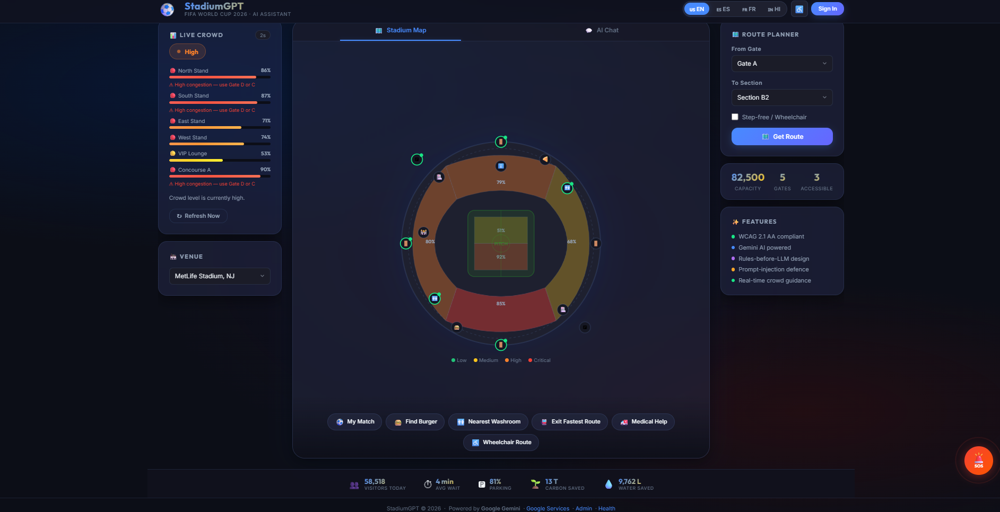
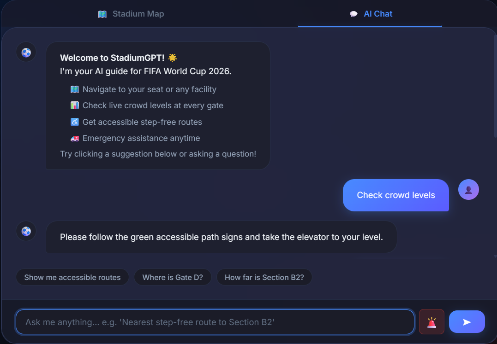

# ⚽ StadiumGPT — FIFA World Cup 2026 AI Assistant

> **GenAI-powered stadium operations & fan experience assistant**  
> Built for the FIFA World Cup 2026 · Rules-before-LLM · Accessibility-first


---

## 🌟 Overview

StadiumGPT is a production-grade GenAI assistant that transforms the fan experience at FIFA World Cup 2026 venues. Arriving at a packed stadium of 80,000+ fans, a fan can simply ask in their own language:

> *"What's the nearest step-free route to my seat?"*

StadiumGPT answers — **grounded, accurate, and inclusive** — without ever inventing a facility.

### The Core Innovation: Rules-Before-LLM

```
Fan Query → Intent Detection → Deterministic Rules Engine → Resolved Facts → Gemini (phrasing only)
```

The **deterministic engine** resolves all facts first (routes, crowd levels, facilities). **Gemini only phrases them** in the fan's language. Gemini **cannot invent** a route or facility — it only makes the facts conversational.

---
## 🌐 Live Demo

🔗 https://stadiumgpt-phi.vercel.app/

> Experience StadiumGPT live.

---
## 📸 Screenshots

### Home Page



### AI Chat



---

## ✨ Key Features

| Feature | Detail |
|---|---|
| 🌍 **Multilingual** | English, Spanish & French — all WC26 host languages |
| ♿ **Accessibility-first** | WCAG 2.1 AA, step-free routing, screen-reader mode |
| 📊 **Real-time crowd guidance** | Live crowd levels with gate recommendations |
| 🗺️ **Smart navigation** | Step-by-step routes with distance & time estimates |
| 🔒 **Secure by design** | Input validation, prompt-injection defence, rate limiting |
| 🏥 **Facility finder** | Medical, restrooms, halal/kosher/vegan food, prayer room |
| 🚌 **Transport info** | Accessible parking, metro routes, shuttle info |
| ♻️ **Sustainability** | Recycling stations, water refill points, eco transport |

---
## ☁️ Google Cloud Services Used

| Service | Purpose |
|---------|----------|
| Gemini 2.5 Flash | AI Assistant |
| Firebase Authentication | User Login |
| Firestore | Real-time Database |
| Google Maps Platform | Stadium Navigation |
| Places API | Facility Search |
| Directions API | Route Planning |
| Cloud Run | Backend Deployment |
| Cloud Storage | Images & Assets |

---

## 🏗️ Architecture

```
┌─────────────────────────────────────────────────────────────────┐
│                     Next.js 15 Frontend                          │
│  React 19 · TypeScript · Firebase Auth · Responsive UI           │
└───────────────────────────┬─────────────────────────────────────┘
                            │ /api/* proxy
┌───────────────────────────▼─────────────────────────────────────┐
│                     Express.js Backend                           │
│   /api/chat  /api/navigate  /api/crowd  /api/sos  /api/stats     │
│   Helmet · CORS · Rate limiting · Zod validation                 │
└──────┬──────────────────────────────────────────┬───────────────┘
       │                                          │
┌──────▼──────────────────┐         ┌────────────▼───────────────┐
│    Rules Engine          │         │    Gemini 2.5 Flash         │
│  Intent detection        │────────▶│  Phrase ONLY resolved facts │
│  Fact resolution         │         │  Safety settings enabled    │
│  Crowd / Nav / Facility  │         │  Prompt-injection guard     │
└──────────────────────────┘         └────────────────────────────┘
       │
┌──────▼──────────────────────────────────────────┐
│  Static JSON Data (pre-validated)               │
│  stadiums.json · routes.json · facilities.json  │
└─────────────────────────────────────────────────┘
```

---

## 🚀 Quick Start

### Prerequisites

- **Node.js 20+** and **npm 10+**
- A [Google Gemini API key](https://aistudio.google.com/app/apikey) (free tier works)

### 1. Clone & Install

```bash
git clone https://github.com/YOUR_USERNAME/StadiumGPT.git
cd StadiumGPT
npm install
```

### 2. Configure

```bash
cp .env.example .env
# Edit .env and add your GEMINI_API_KEY
```

### 3. Run

```bash
npm run dev
```

- **Frontend** → http://localhost:3000
- **Backend API** → http://localhost:8080

---

## 📁 Project Structure

```
StadiumGPT/
├── frontend/                   # Next.js 15 + React 19
│   ├── src/
│   │   ├── app/               # App Router pages & layouts
│   │   ├── components/        # Reusable UI components
│   │   ├── hooks/             # Custom React hooks
│   │   ├── lib/               # Firebase, utilities
│   │   ├── services/          # API client layer
│   │   ├── store/             # State management
│   │   ├── types/             # TypeScript interfaces
│   │   └── utils/             # Helper functions
│   ├── next.config.ts
│   ├── tsconfig.json
│   └── package.json
│
├── backend/                    # Express.js API
│   ├── src/
│   │   ├── controllers/       # Route handlers
│   │   ├── routes/            # Express routers
│   │   ├── services/          # Gemini client, rules engine
│   │   ├── middleware/        # Rate limiting, validation
│   │   ├── data/              # Static JSON data files
│   │   ├── config/            # App configuration
│   │   ├── types/             # TypeScript interfaces
│   │   ├── utils/             # Helper functions
│   │   └── index.ts           # Express entry point
│   ├── tsconfig.json
│   └── package.json
│
├── cloud-functions/            # Optional serverless functions
│   ├── crowd_sensor/
│   └── notifier/
│
├── vercel.json                 # Vercel deployment config
├── .env.example                # Environment variable template
├── .gitignore
├── package.json                # Monorepo root (npm workspaces)
└── README.md
```

---

## 📡 API Reference

### `POST /api/chat`
Main fan query endpoint.

```json
{
  "message": "Where is the nearest accessible restroom?",
  "language": "en",
  "stadium_id": "met_life",
  "accessibility_mode": false
}
```

### `POST /api/navigate`
Step-free route planning.

### `POST /api/crowd`
Live crowd density data.

### `POST /api/sos`
Emergency assistance.

### `GET /health`
Health check — returns Gemini availability status.

---

## ☁️ Deploy to Vercel

```bash
# Install Vercel CLI (if not installed)
npm i -g vercel

# Deploy
vercel --prod
```

Or connect the GitHub repo to Vercel for automatic deployments on every push.

**Environment variables to set in Vercel dashboard:**
- `GEMINI_API_KEY` — your Google Gemini API key
- `GEMINI_MODEL` — `gemini-2.5-flash` (default)
- `NEXT_PUBLIC_API_URL` — your backend URL

---

## 🔒 Security Design

| Layer | Mechanism |
|---|---|
| Input validation | Zod schemas, length limits |
| Prompt injection | Pattern filters (ignore previous, act as, jailbreak, XSS, etc.) |
| Rate limiting | Sliding-window per-IP: 30 req/60s |
| LLM hallucination | Rules-before-LLM — Gemini never resolves facts |
| API safety | Gemini safety settings on all categories |

---

## 🌍 Supported Languages

| Code | Language | UI | AI Responses |
|---|---|---|---|
| `en` | English 🇺🇸 | ✅ | ✅ |
| `es` | Español 🇪🇸 | ✅ | ✅ |
| `fr` | Français 🇫🇷 | ✅ | ✅ |

---

## 🏟️ Supported Venues (WC26)

| Venue | City | Capacity |
|---|---|---|
| MetLife Stadium | East Rutherford, NJ | 82,500 |
| SoFi Stadium | Inglewood, CA | 70,240 |
| AT&T Stadium | Arlington, TX | 80,000 |
| *+ 13 more* | *Across USA, Canada & Mexico* | — |

---
## 👨‍💻 Developer

**Sahil**

B.Tech CSE (AI & DS)

GitHub:
https://github.com/Sahil-242-ops

LinkedIn:
https://www.linkedin.com/in/sahil-118561320/

---

## ⭐ Built On The Basis Of GenAI

Powered by

- Google Gemini
- Firebase
- Google Maps Platform
- Next.js
- Express.js
- TypeScript

If you like this project, please ⭐ the repository.
